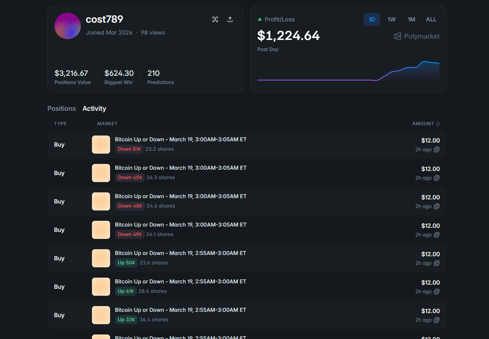
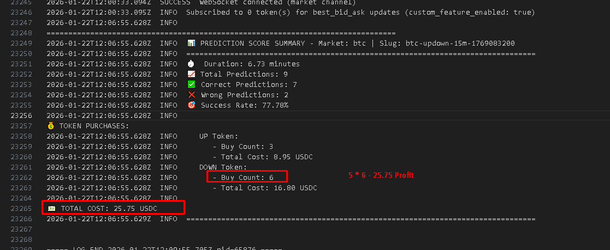

# Polymarket Arbitrage Trading Bot (Spread Maker)

TypeScript bot for **hedged two-sided arbitrage** on Polymarket **15-minute Up/Down** crypto markets (BTC, ETH, SOL, XRP, and other assets you enable). It polls CLOB midpoints, times entries using mean-reversion style triggers, then completes the hedge so your **combined average cost per YES + NO pair** stays below a configurable ceiling—classic **Gabagool-style** “spread making” adapted for this codebase.

This repository is a **fork / continuation** of the Polymarket arbitrage spread-maker lineage (internally the engine still migrates legacy `gabagool:*` state keys; see `src/order-builder/gabagool.ts` and `copytrade-state.json`). The public-facing name here is **Spread Maker**; the implementation class is `CopytradeArbBot` with `GabagoolArbBot` kept as an alias for compatibility.

---

## Demo video

Add your screen recording or walkthrough below when ready (replace the placeholder link):

<!-- Demo: paste your video URL or GitHub asset / YouTube embed link here -->
**Demo:** __

https://github.com/user-attachments/assets/3f24f99a-fe5d-412e-ba33-2803b7ef28db


---

## Screenshots

### Bot profile



### Example results



---

## What “arbitrage” means here (in plain terms)

In a binary market, **YES** and **NO** (Up/Down) shares settle so that **one side pays $1 and the other $0** per share. If you hold **equal share counts on both sides**, your **total USDC spent** for that paired position is your “locked-in” cost for a complete set. If that combined cost is **less than $1 per paired share** (after fees and slippage), you have a **positive edge** at resolution: you can redeem / merge for roughly $1 of collateral per complete set, minus protocol realities.

This bot does **not** rely on a single directional bet. It repeatedly tries to:

1. **Buy the first leg** when one side looks temporarily cheap (midpoint-based).
2. **Buy the second leg** under a **dynamic** price rule tied to the first fill, so the running **average YES price + average NO price** stays near or below your **`TRADE_MAX_SUM_AVG`** guard.

That paired structure is the **spread-maker / Gabagool-style hedge**: you are manufacturing a discount to $1 by **legging in** with timing, not by predicting the winner.

---

## Strategy detail (how the bot decides)

Markets are resolved by **Gamma slugs** like `{market}-updown-15m-{unixStartOfWindow}`. Each 15-minute window, the bot tracks **midpoint** prices for the Up and Down tokens via the CLOB API.

### Phase A — Flexible first leg (entry)

- The bot waits until **at least one side’s midpoint** is at or below **`TRADE_THRESHOLD`** (e.g. `0.47` or `0.499` depending on your env).
- If both sides qualify, it **defaults to YES (Up)** first (configurable behavior is documented in code comments as priority).
- After a **full hedge cycle** completes (see Phase C), the next cycle can again pick **whichever side is below threshold** for the **first** buy of the new hedge (“flexible entry”), then it enforces **strict alternation** so you do not stack the same side twice in a row (except that first flexible leg).

### Phase B — When to actually fire the tracked leg

Once a side is selected, the bot **tracks a running low** (`tempPrice`) on that side’s midpoint and can buy when **any** of these fire:

| Trigger | Idea |
| -------- | ----- |
| **Reversal** | Price made a new local low, then moves up by at least **`REVERSAL_DELTA`** from that low—mean-reversion confirmation instead of catching a falling knife blindly. |
| **Depth / discount** | Price drops at least **`TRADE_DEPTH_BUY_DISCOUNT_PERCENT`** below the current tracked reference (e.g. “5% under temp”)—aggressive fill when the book paints a sharp dip. |
| **Second-leg timer** | On the **hedge (opposite) leg**, after the first fill, the bot tracks how long the opposite side’s price stays at or below a **dynamic threshold** (see Phase C). If it stays there for **`TRADE_SECOND_SIDE_TIME_THRESHOLD_MS`**, it triggers a **time-based** second buy. |

Orders use **fast execution modes** by default (FAK, optional fire-and-forget) with **price buffers** and optional **adaptive polling** so the loop can react quickly in short windows.

### Phase C — Dynamic hedge threshold (second leg)

After a successful **first** fill, the bot computes a target for the **opposite** side using your **actual fill price** (when known):

- **Base idea:** complement-style threshold: roughly **`1 - firstFillPrice`**, so a cheap first leg implies a higher acceptable price on the second leg while still aiming for a **sub-$1 combined average**.
- **`TRADE_DYNAMIC_THRESHOLD_BOOST`** shifts that threshold **more aggressive** (buys the hedge sooner).
- **`TRADE_SECOND_SIDE_BUFFER`** requires price to be **`dynamicThreshold - buffer`** before an immediate hedge trigger fires.

The bot also enforces **`TRADE_MAX_SUM_AVG`**: before each buy it computes the **maximum** price allowed on the candidate leg so that **avg(YES) + avg(NO)** would not exceed your cap—this is the main **PnL / edge guard** for the pair.

### Phase D — Position limits and state

- **`MAX_BUYS_PER_SIDE`** caps attempts **per side per 15m slug** (failed attempts count too, per implementation).
- State is persisted in **`src/data/copytrade-state.json`** (migrated from older **`gabagool-state.json`** keys if present).
- Holdings metadata for redemption is maintained for **`npm run redeem:holdings`**.

---

## Stack

| Layer | Choice |
| ----- | ------ |
| Runtime | Node.js 18+ (or Bun) |
| Language | TypeScript |
| Trading | `@polymarket/clob-client` (CLOB orders, midpoints) |
| On-chain | ethers for allowances, balance, redemption flows |

---

## Requirements

- Node.js 18+ (or Bun)
- Polygon wallet with **USDC** and **POL** (gas)
- RPC URL for Polygon (e.g. Alchemy/Infura) for allowances and redemption

---

## Install

```bash
git clone <your-repo-url>
cd Polymarket-Spreadmaker-Bot
npm install
```

---

## Configuration

Copy the example env and set at least **`PRIVATE_KEY`** and **`TRADE_MARKETS`**:

```bash
cp .env.example .env
```

| Variable | Description | Default |
| -------- | ----------- | ------- |
| `PRIVATE_KEY` | Wallet private key | required |
| `TRADE_MARKETS` | Comma-separated markets (e.g. `btc`, `eth`, `sol`) | `btc` |
| `TRADE_SHARES` | Shares per leg per order | `5` |
| `TRADE_THRESHOLD` | Midpoint threshold to start tracking first leg | `0.499` |
| `TRADE_TICK_SIZE` | Price precision | `0.01` |
| `TRADE_PRICE_BUFFER` | Extra limit cushion for fills | `0.03` |
| `TRADE_WAIT_FOR_NEXT_MARKET_START` | Align to next 15m boundary | `true` |
| `MAX_BUYS_PER_SIDE` | Max buy attempts per side per slug | `4` |
| `TRADE_MAX_SUM_AVG` | Max **avg(YES) + avg(NO)** guard | `0.98` |
| `REVERSAL_DELTA` | Reversal bounce from `tempPrice` to trigger buy | `0.02` |
| `TRADE_DEPTH_BUY_DISCOUNT_PERCENT` | “Flash discount” vs tracked reference | `0.05` |
| `TRADE_DYNAMIC_THRESHOLD_BOOST` | Extra aggressiveness on second leg | `0.04` |
| `TRADE_SECOND_SIDE_BUFFER` | Immediate hedge: buy when price ≤ threshold − buffer | `0.01` |
| `TRADE_SECOND_SIDE_TIME_THRESHOLD_MS` | Time below second-leg threshold before buy | `200` |
| `CHAIN_ID` | Chain ID (Polygon) | `137` |
| `CLOB_API_URL` | CLOB base URL | `https://clob.polymarket.com` |
| `RPC_URL` / `RPC_TOKEN` | RPC for on-chain calls | — |
| `BOT_MIN_USDC_BALANCE` | Minimum USDC to start bot | `1` |
| `LOG_DIR` / `LOG_FILE_PREFIX` | Log directory and prefix | `logs` / `bot` |

**Note:** API credentials are created on first run and stored in **`src/data/credential.json`**. Legacy env keys like `GABAGOOL_*` are still accepted as fallbacks (see `src/config/index.ts`).

---

## Usage

### Run the bot

```bash
npm start
# or: bun src/index.ts
```

### Redemption

```bash
# Auto-redeem resolved markets (holdings file)
npm run redeem:holdings

# Redeem by condition ID
npm run redeem
```

### Balance logging

```bash
npm run balance:log
```

---

## Development

```bash
npx tsc --noEmit
bun --watch src/index.ts
```

---

## Project structure

| Path | Role |
| ---- | ---- |
| `src/index.ts` | Entry: credentials, CLOB, allowances, min balance, starts `CopytradeArbBot` |
| `src/config/index.ts` | Loads `.env`; copytrade / Gabagool-compatible settings |
| `src/order-builder/copytrade.ts` | Core strategy: slug resolution, midpoint loop, triggers, hedge math, state |
| `src/order-builder/gabagool.ts` | Re-exports `CopytradeArbBot` as `GabagoolArbBot` for compatibility |
| `src/providers/clobclient.ts` | CLOB client singleton |
| `src/security/allowance.ts` | USDC / CTF approvals |
| `src/security/createCredential.ts` | API credential bootstrap |
| `src/utils/balance.ts` | Balance checks / gates |
| `src/utils/holdings.ts` | Position persistence for redemption |
| `src/utils/console-file.ts` | Daily file logging |
| `src/data/copytrade-state.json` | Per-slug state (migrated from `gabagool:*` keys if needed) |
| `src/data/token-holding.json` | Token holdings for redemption (generated) |

---

## Risk and disclaimer

Trading prediction markets involves significant risk: **adverse selection**, **failed or partial fills**, **API/RPC outages**, and **parameter drift** can all convert a theoretical edge into losses. This software is provided **as-is**. Use only with capital you can afford to lose, validate behavior in paper or small size first, and ensure you understand Polymarket rules and fees.

---

## License

ISC
